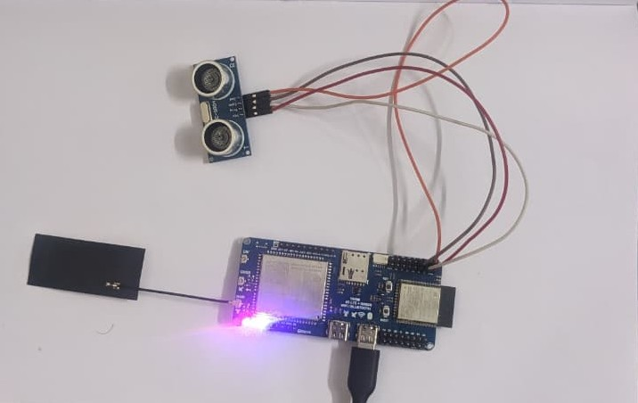
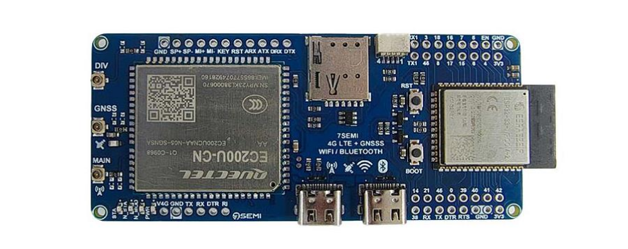
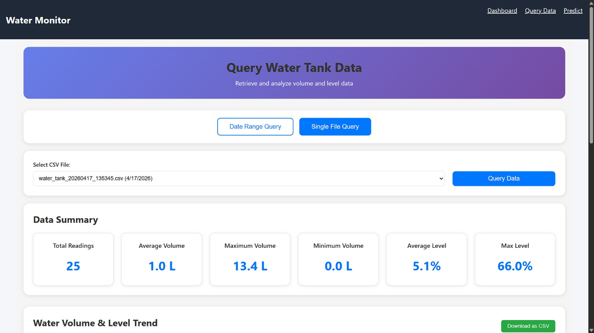
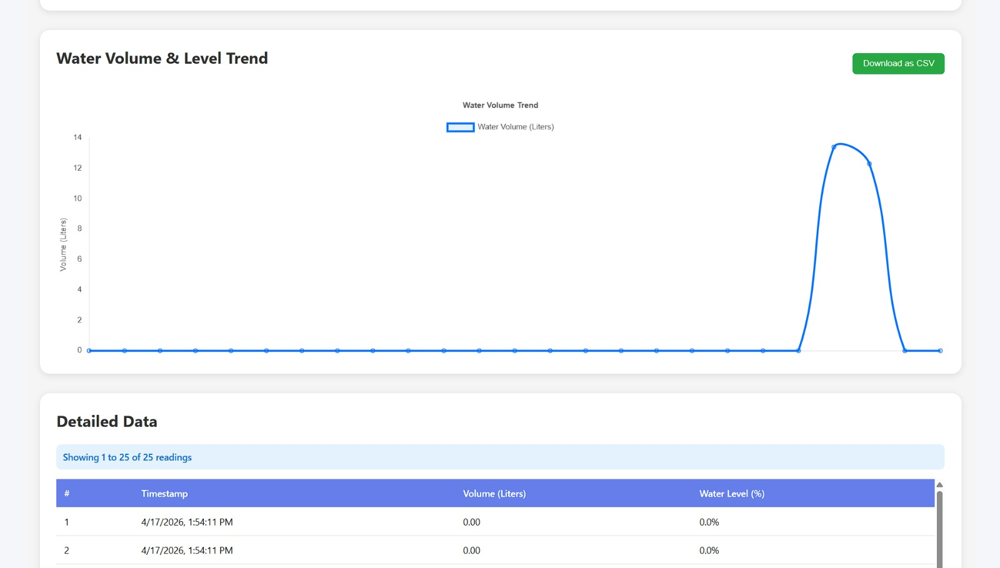
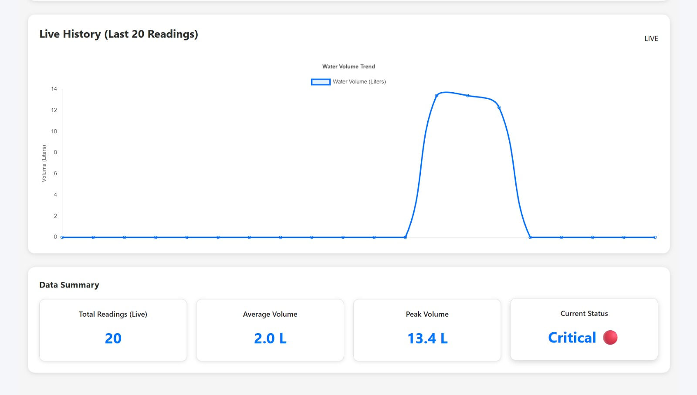
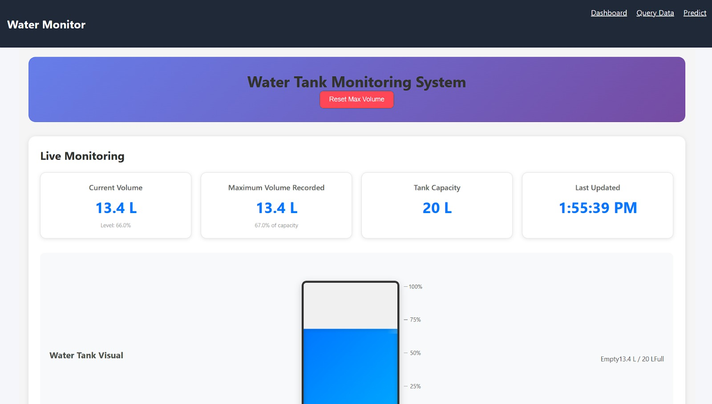

# IoT Smart Water Monitoring System
> Real-time tank water level monitoring using ESP32, Ultrasonic Sensor, and ThingsBoard with a Custom React Dashboard.

## Project Overview
This project monitors water tank levels using an ultrasonic sensor (HC-SR04) and an ESP32 microcontroller equipped with an EC200U LTE modem. Data is sent to the ThingsBoard IoT platform, and a custom React + Node.js website fetches this data to display live monitoring, historical graphs, and water consumption predictions. The backend also logs all telemetry to Google Drive as CSV files for long-term storage and analysis.

## Features
- **Real-time Monitoring:** Live water level and volume tracking.
- **Advanced Filtering:** EMA & Median filtering on the ESP32 for accurate, noise-free sensor readings.
- **LTE Connectivity:** Cellular internet via EC200U modem.
- **Cloud Synchronization:** ThingsBoard MQTT API integration.
- **Data Logging:** Automatic background logging to Google Drive as CSV files.
- **Custom Dashboard:** Live React Dashboard with historical charts and water consumption prediction.
- **Responsive UI:** Modern, responsive, and user-friendly web interface.

## System Architecture
**Ultrasonic Sensor → ESP32 → LTE Network → ThingsBoard (MQTT) → Custom Website Backend (REST API) → React Dashboard (HTTP/REST)**

- **ESP32 to ThingsBoard**: MQTT Protocol over LTE
- **ThingsBoard to Website Backend**: REST API (HTTP GET)
- **Backend to Google Drive**: Google Drive API (REST)
- **Backend to React Frontend**: HTTP REST API

## Hardware Used
| Component | Quantity | Purpose |
| :--- | :---: | :--- |
| **ESP32-S3** | 1 | Main microcontroller for processing sensor data |
| **EC200U LTE Modem (7SEMI)** | 1 | Provides cellular internet connectivity |
| **HC-SR04 / JSN-SR04T** | 1 | Ultrasonic sensor for distance measurement |
| **5V Power Supply** | 1 | Powers the ESP32 and Modem |
| **Jumper Wires** | varies | Connections between components |
| **Water Tank** | 1 | Physical container being monitored (28.7 cm height, 30 cm diameter) |

## Software/Tools Used
- **Arduino IDE (C++)** (Firmware)
- **ThingsBoard Cloud** (IoT Platform)
- **Node.js & Express** (Backend Server)
- **React, Vite, Chart.js** (Frontend Dashboard)
- **Google Drive API** (Cloud Storage)
- **MQTT Protocol** (Data Transmission)

## Circuit Diagram / Wiring



**Pin Connections:**
- **HC-SR04 Sensor**:
  - `VCC` → 5V
  - `GND` → GND
  - `TRIG` → GPIO 4
  - `ECHO` → GPIO 5
- **EC200U LTE Modem**:
  - `TX` → GPIO 12 (ESP32 RX2)
  - `RX` → GPIO 13 (ESP32 TX2)
  - `GND` → GND

## Gallery
### Website Dashboard





## Video Demo
[Click to watch the Project Demonstration Video](assets/PROJECT_DEMONSTRATION_VIDEO.mp4)

## ThingsBoard Setup Instructions
1. Create a [ThingsBoard Cloud](https://thingsboard.cloud) account (or self-hosted).
2. Go to **Entities > Devices** and click **+ Add new device**. Name it (e.g., `esp32_water_tank_01`).
3. Open the device details, click **Manage credentials**, and copy the **Access Token**.
4. Create a User JWT token from your profile or admin settings for the backend to use.
5. Go to **Dashboards** and create a new dashboard to visualize incoming telemetry (`distance_cm`, `level_percent`, `volume_liters`).

## Installation & Setup

### 1. Clone the repository
```bash
git clone https://github.com/Tamilarasan07-2005/iot-water-level-monitor-esp32.git
cd iot-water-level-monitor-esp32
```

### 2. Flash the Firmware
1. Open `firmware/water_level_monitor/water_level_monitor.ino` in Arduino IDE.
2. Update your configuration variables at the top of the file:
   ```cpp
   const char* APN = "airtelgprs.com"; // Your cellular APN
   const char* TB_TOKEN = "YOUR_THINGSBOARD_DEVICE_TOKEN"; // Pre-configured ThingsBoard Token
   ```
3. Select your ESP32 board and upload the code. No external libraries are needed beyond the built-in `HardwareSerial`.

### 3. Setup the Backend
1. Navigate to the backend directory:
   ```bash
   cd website/backend
   npm install
   ```
2. The `.env` file and `credentials.json` are already pre-configured for your Google Drive and ThingsBoard setup.
3. Start the server:
   ```bash
   npm start
   ```
5. On the first run, follow the terminal prompt to authorize Google Drive and generate `token.json`.

### 4. Setup the Frontend
1. Navigate to the frontend directory:
   ```bash
   cd website/frontend
   npm install
   ```
2. Start the React app:
   ```bash
   npm run dev
   ```

## Usage
- Power up the ESP32 setup. It will connect to the LTE network and start publishing telemetry to ThingsBoard.
- The Node.js backend will automatically poll ThingsBoard every 5 seconds, buffer the data, and upload completed CSV files to Google Drive.
- Open the React frontend (`http://localhost:5173`) to view the live dashboard, query historical data from Google Drive, and view the 2026 water consumption predictions.

## Troubleshooting
- **Sensor reading stuck or error**: Check the wiring to pins 4 and 5. Ensure the sensor face is clean. The firmware has an auto-reset if it detects the EMA filter is stuck.
- **LTE not connecting**: Ensure the SIM card is inserted, has an active data plan, and the APN is correctly set for your network provider.
- **ThingsBoard not receiving data**: Check the ESP32 serial monitor. Ensure the `TB_TOKEN` is correct. Verify the LTE connection is established before MQTT connects.
- **Website backend Google Drive auth fails**: Ensure your `credentials.json` is correct and you have authorized the app. Delete `token.json` and restart the backend to re-authorize.

## Future Improvements
- Add a battery management system for solar power.
- Implement push notifications/alerts for low water levels.
- Add an interactive calibration page on the dashboard to adjust tank dimensions dynamically.

## License
MIT License

## Author
TamilArasan R
